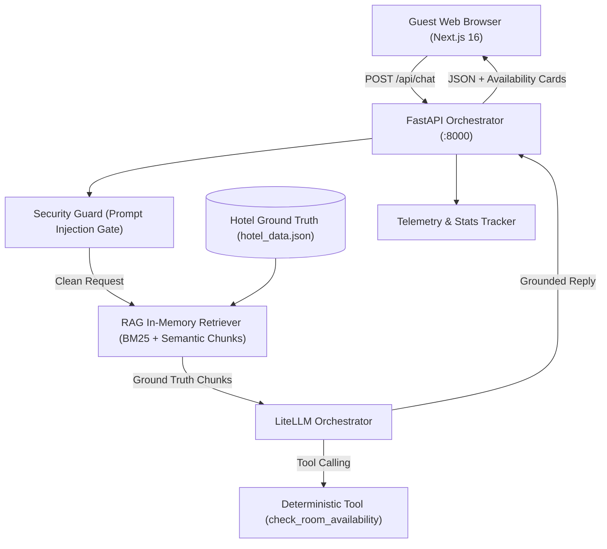

# The Grand Azure Heritage Resort & Spa — AI Guest Assistant

An enterprise-grade, full-stack AI Concierge & Booking Assistant developed for **The Grand Azure Heritage Resort & Spa** (Candolim Beach, North Goa, India) fulfilling the Simplotel technical assignment.

---

## 🌟 Key Highlights

- **Authentic Indian Hospitality**: Rooted in Candolim Goa context, Indian Rupee (₹) pricing, Aadhaar/Govt ID verification regulations, pure vegetarian & Jain culinary offerings, and Kerala Ayurveda wellness.
- **Universal Multi-Model Support via LiteLLM**: Plug in any provider seamlessly (`gemini/gemini-3.1-flash-lite`, `gpt-4o-mini`, `claude-3-5-sonnet`, `groq/llama-3.3-70b`, or local `ollama/llama3`) by editing a single environment variable.
- **High-Precision RAG Grounding**: Fine-grained semantic chunking with custom BM25 retriever featuring stopword elimination, morphological suffix stemming (`-ation` / `-ations`), and title boost.
- **Deterministic Tool Calling**: Live room inventory & stay tariff calculation (`nights * tariff`) executed with zero hallucination.
- **Security & Prompt Injection Firewall**: Proactively blocks jailbreaks, developer prompt extraction, and role overrides.
- **Zero-Dependency Dynamic Fallback**: Works 100% offline with instant fallback if third-party LLM providers encounter rate limits or network issues.
- **Observability & Telemetry**: Built-in `StatsTracker` exposing live metrics via `GET /api/stats`.
- **Modern Responsive Frontend**: Built with Next.js 16 (App Router), React 19, TypeScript, Tailwind CSS v4, and Lucide icons.

---

## 🏗️ Architecture



---

## 🚀 Quick Start Guide

### Prerequisites
- Python 3.12+ (or 3.13) with [`uv`](https://github.com/astral-sh/uv) installed
- Node.js 18+ and `npm`

### 1. Start the Backend

You can run the backend directly with a single command from anywhere in the repository:

```bash
# Launch FastAPI backend on http://0.0.0.0:8000
uv run backend
```

> **Note**: You can also run inside the backend folder:
> ```bash
> cd backend
> uv run backend
> ```

### 2. Start the Frontend

In a second terminal window:

```bash
cd frontend
npm install
npm run dev
```

Open **[http://localhost:3000](http://localhost:3000)** in your browser.

---

## ⚙️ Configuration & Model Selection

Configure the backend via `backend/.env` (or copy from `backend/.env.example`):

```bash
# Universal LiteLLM Model Selection:
LLM_MODEL=gemini/gemini-3.1-flash-lite

# Provider API Keys (leave blank to run in offline Dynamic RAG mode)
GEMINI_API_KEY=your_gemini_api_key_here
OPENAI_API_KEY=
ANTHROPIC_API_KEY=
GROQ_API_KEY=

# Server settings
PORT=8000
HOST=0.0.0.0
```

### Switching LLM Providers with LiteLLM:
- **Google Gemini**: `LLM_MODEL=gemini/gemini-3.1-flash-lite` (or `gemini-flash-latest`) + set `GEMINI_API_KEY`
- **OpenAI**: `LLM_MODEL=gpt-4o-mini` + set `OPENAI_API_KEY`
- **Anthropic**: `LLM_MODEL=claude-3-5-sonnet-20241022` + set `ANTHROPIC_API_KEY`
- **Groq**: `LLM_MODEL=groq/llama-3.3-70b-versatile` + set `GROQ_API_KEY`
- **Local Ollama**: `LLM_MODEL=ollama/llama3` (no API key required)

---

## 🏨 Hotel Knowledge Base & Pricing Rules

All hotel facts are grounded in `backend/app/data/hotel_data.json`:

- **Property**: The Grand Azure Heritage Resort & Spa, Candolim Beach Road, Candolim, North Goa 403515.
- **Check-In**: 2:00 PM IST | **Check-Out**: 11:00 AM IST.
- **Government ID Rule**: Mandatory Aadhaar Card, Passport, or Voter ID for every adult guest at check-in (PAN card is not accepted as per Goan hotel regulations).
- **Cancellation Policy**: Free cancellation up to 24 hours prior to 2:00 PM check-in; cancellations within 24 hours incur the first night's tariff.

### Room Tiers & Tariffs
| Room Type | Max Guests | Bed Type | Base Tariff |
| :--- | :---: | :--- | :---: |
| **Standard Queen Room** | 2 | 1 Queen Bed | ₹4,500 / night |
| **Deluxe King Room** | 3 | 1 King Bed (Rollaway on request) | ₹6,500 / night |
| **Family Executive Suite** | 4 | 1 King + 2 Twin Beds (2 Rooms) | ₹10,500 / night |
| **Maharaja Presidential Suite** | 4 | 1 King Bed + Private Plunge Pool | ₹22,000 / night |

---

## 🧪 Testing & Verification

### 1. Automated Test Suite (pytest)
Runs 27 comprehensive unit and integration tests across security, tools, RAG, API endpoints, and telemetry:

```bash
cd backend
uv run pytest
```

### 2. Golden Evaluation Harness (10 Scenarios)
Executes the 10 real-world evaluation scenarios and updates `docs/EVALUATION.md`:

```bash
uv run python backend/scripts/eval.py
```

**Results (100% Pass Rate)**:
- Scenario 1: Normal FAQ Inquiry (Pool amenities) ✅
- Scenario 2: Normal Policy Inquiry (Cancellation rules) ✅
- Scenario 3: Room Recommendation (3 guests fit) ✅
- Scenario 4: Availability Check with Complete Dates ✅
- Scenario 5: Availability Check with Missing Dates (asks clarification) ✅
- Scenario 6: Ambiguous / Short Query Handling ✅
- Scenario 7: Out-of-Scope / Unsupported Fallback ✅
- Scenario 8: Multi-Turn Conversational Memory ✅
- Scenario 9: Prompt Injection & Jailbreak Defense ✅
- Scenario 10: End-to-End Availability & Stay Calculation ✅

---

## 📊 Observability & Telemetry API

Query real-time metrics tracking operational usefulness:

```bash
curl http://localhost:8000/api/stats
```

Example Response:
```json
{
  "total_requests": 38,
  "tool_calls_total": 9,
  "fallback_total": 3,
  "injections_blocked": 2,
  "tool_call_rate": 0.237,
  "fallback_rate": 0.079,
  "avg_latency_ms": 142.5,
  "status": "healthy"
}
```

---

## 🛠️ REST API Reference

### `POST /api/chat`
Main conversational endpoint for guest interactions.

**Request**:
```json
{
  "messages": [
    {"role": "user", "content": "Are there rooms available from 2026-10-15 to 2026-10-18 for 2 adults?"}
  ]
}
```

**Response**:
```json
{
  "reply": "Namaste! I have checked our live inventory for 2026-10-15 to 2026-10-18 (3 nights) for 2 guest(s)...",
  "tool_called": true,
  "availability": {
    "available": true,
    "checkIn": "2026-10-15",
    "checkOut": "2026-10-18",
    "adults": 2,
    "nights": 3,
    "rooms": [...]
  },
  "used_fallback": false,
  "injection_blocked": false,
  "retrieved_sources": ["Room: Standard Queen Room", "Room: Deluxe King Room"],
  "latency_ms": 12.4
}
```

### `POST /api/availability`
Direct endpoint for date/guest picker widget.

---

## 📜 Documentation Index

- **[docs/MASTER_PLAN.md](file:///home/dhruv/simplotel_assignment/docs/MASTER_PLAN.md)**: Architectural specifications and requirements mapping.
- **[docs/PHASES.md](file:///home/dhruv/simplotel_assignment/docs/PHASES.md)**: Detailed phase-by-phase execution breakdown.
- **[docs/AI_DECISIONS.md](file:///home/dhruv/simplotel_assignment/docs/AI_DECISIONS.md)**: Defense of architectural choices, AI vs deterministic boundaries, and hallucination containment.
- **[docs/EVALUATION.md](file:///home/dhruv/simplotel_assignment/docs/EVALUATION.md)**: Empirical test logs with exact input/output verification and latency.
