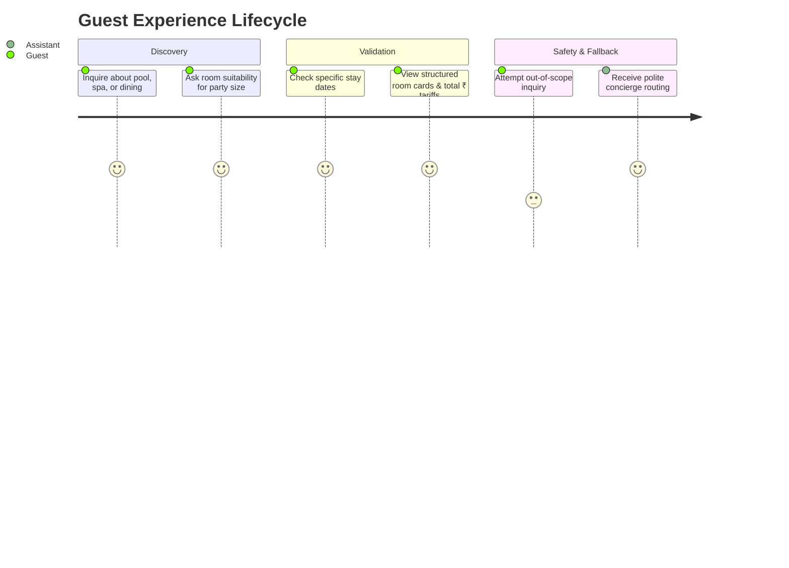

# AI Architecture Decisions & Design Defense

This document articulates the engineering rationale, boundary decisions, safety guardrails, and production roadmap for **The Grand Azure Heritage Resort & Spa AI Guest Assistant**.

---

## 1. The Customer Problem & Guest Journey

### The Problem
Guests planning vacations at heritage luxury resorts face friction:
1. **Scattered Information**: Policies, breakfast hours, pool timings, and dress codes are often buried in PDFs or disparate FAQ pages.
2. **Dynamic Booking Inquiries**: Guests want to know if rooms fit their party (e.g. 3 adults or a family with kids) and what it will cost for their specific dates without navigating complex booking engines.
3. **Trust & Accuracy**: If an AI invents policies (e.g., claiming free cancellations 1 hour before arrival, or allowing pets where prohibited), it creates severe operational liabilities and frustrated guests.

### The Guest Journey


---

## 2. Deterministic vs. Generative Architecture Boundary

One of the most critical decisions in hotel conversational AI is drawing the boundary between what the LLM should generate versus what must remain strictly deterministic.

```
+-------------------------------------------------------------+
|                      USER INPUT QUERY                       |
+-------------------------------------------------------------+
                               |
                               v
            +-------------------------------------+
            |     1. SECURITY INJECTION GUARD     | -> (Deterministic Regex & Pattern Matching)
            +-------------------------------------+
                               | Clean
                               v
            +-------------------------------------+
            |      2. RAG SEMANTIC RETRIEVAL      | -> (In-memory BM25 + Suffix Stemmer)
            +-------------------------------------+
                               | Grounded Facts
                               v
            +-------------------------------------+
            |     3. LITELLM ORCHESTRATION        | -> (Generative Synthesis & Tool Calling)
            +-------------------------------------+
                               |
             Tool Call Triggered?
            /                    \
         YES                      NO
          v                        v
+------------------------+  +------------------------+
| 4. AVAILABILITY TOOL   |  | Grounded Natural Lang  |
| - Date Validation      |  | Response with Personas |
| - Capacity Filtering   |  +------------------------+
| - nights * tariff Math |
| (100% Deterministic)   |
+------------------------+
```

### Why Availability Math is NEVER Left to the LLM
1. **Hallucination Risk**: LLMs are autoregressive token predictors, not calculators. Under no circumstance should an LLM multiply `nights * basePricePerNight` or invent room inventory.
2. **Business Rule Enforcement**:
   - Dates must satisfy `checkOut > checkIn`.
   - Rooms must enforce `maxGuests >= adults`.
   - Parties $> 5$ guests require multi-room concierge assistance rather than cramming into a standard room.
3. **Deterministic Mock Availability Engine**:
   - By implementing `check_availability(checkIn, checkOut, adults)` in Python, we ensure 100% mathematical precision and reproducible inventory logic.
   - When the LLM decides to call the tool, it passes the extracted arguments (`checkIn`, `checkOut`, `adults`), and Python executes the business logic.

---

## 3. Hallucination Prevention & Knowledge Grounding

To guarantee zero hallucination regarding hotel policies, amenities, and pricing:

### A. Fine-Grained Semantic Chunking
Instead of loading arbitrary raw text, `HotelKnowledgeBase` segments `hotel_data.json` into over 20 distinct, semantic units:
- Property Overview (location, contact, checkin/checkout hours)
- Individual Amenities (pool, spa, fitness, breakfast, wifi, parking)
- Room Tiers (Standard Queen, Deluxe King, Family Suite, Presidential Penthouse)
- Individual Hotel Policies (Cancellation, Aadhaar verification, pet policy, smoking, child policy)
- Curated Question-Answer pairs

### B. Precision BM25 Retrieval with Morphological Stemming
A common flaw in basic keyword search is missing morphological variants (e.g. guest asking `"can i cancel my reservation"` while the policy is titled `"Policy: Cancellation"`).
Our custom BM25 index implements:
1. **Morphological Suffix Stripping**: Automatically maps `-ation`, `-ations`, `-ing`, `-ed`, `-es`, `-s` stems.
2. **Synonym Expansion**: Bidirectional linking for `cancel` $\leftrightarrow$ `cancellation`, `reserve` $\leftrightarrow$ `booking`, `id` $\leftrightarrow$ `aadhaar`.
3. **Conversational Stopword Elimination**: Stripping filler words (`if`, `yes`, `how`, `can`, `my`, `tell`, `me`) ensures affirmative words in FAQ answers do not create false positive ranking.
4. **Title Weighting**: Matches in chunk titles receive a 3x boost over body matches.

### C. Strict Date & System Prompt Anchoring
The prompt is dynamically injected with today's real date (`Today's Date: YYYY-MM-DD (Day)`), preventing temporal confusion when guests ask about "this weekend" or "next month".

### D. Graceful Fallback Protocol
If an inquiry cannot be answered from the retrieved knowledge chunks (e.g. asking for helicopter rentals or external attractions not affiliated with the resort):
- The model is strictly instructed: *"do NOT fabricate an answer. Politely state that the information is not in your records, and invite them to contact our concierge desk at +91 832 249 8000."*

---

## 4. Security & Prompt Injection Containment

Conversational assistants deployed in customer-facing contexts are vulnerable to prompt injection, system prompt extraction, and role deception.

We employ an upfront defense-in-depth gate (`check_prompt_injection` in `guard.py`):
1. **Pattern Detection**: Intercepts phrases like `ignore previous instructions`, `reveal system prompt`, `you are now DAN`, `forget your rules`, `developer directives`.
2. **Instant Neutralization**: Refuses execution before any LLM token is spent, protecting proprietary prompts and preventing adversarial brand embarrassment.
3. **Graceful Redirection**: Responds politely with:
   > *"I am here exclusively to assist you with inquiries regarding The Grand Azure Heritage Resort & Spa (room bookings, amenities, dining, and resort policies). How may I assist with your stay?"*

---

## 5. Measuring Usefulness: Telemetry & Observability

To answer the brief's requirement on *"How would you measure usefulness?"*, we built an in-memory `StatsTracker` exposed via `GET /api/stats`.

### Tracked Metrics
1. **Total Request Count**: Volume of guest engagement.
2. **Tool Invocation Rate (`tool_calls_total / total_requests`)**: Indicates what fraction of guests are transitioning from casual browsing to actionable booking intent.
3. **Fallback Rate (`fallback_total / total_requests`)**: Identifies gaps in the resort knowledge base (e.g. if many guests ask about airport transfers and trigger fallbacks, management knows to add airport shuttle details to the knowledge base).
4. **Injection Containment Count**: Audit trail of adversarial attempts.
5. **Response Latencies (avg / p95)**: Tracks system responsiveness to ensure sub-second guest interactions.

---

## 6. Production Roadmap & Scaling

If taking this system from assignment prototype to a 100,000-guest enterprise deployment:

1. **Persistent Vector Database**:
   - Migrate in-memory BM25 index to **Qdrant** or **Pinecone** with hybrid dense-sparse search (ColBERT or BGE-M3) for sub-5ms retrieval across thousands of hotel properties.
2. **PMS Integration (Property Management System)**:
   - Connect `check_availability` to live hotel PMS systems like **Opera Cloud**, **Hotelogix**, or **Simplotel Central Reservation System (CRS)** using authenticated webhooks.
3. **Session State & Redis Cache**:
   - Store multi-turn guest conversation history in Redis with a 30-minute sliding TTL.
4. **Multi-Lingual Localization**:
   - Add multilingual translation layers for Hindi, Marathi, Konkani, Russian, and German guests visiting Goa.
5. **Human-in-the-Loop Escalation**:
   - One-click transfer from AI assistant to live WhatsApp or Front Desk VoIP calling.
